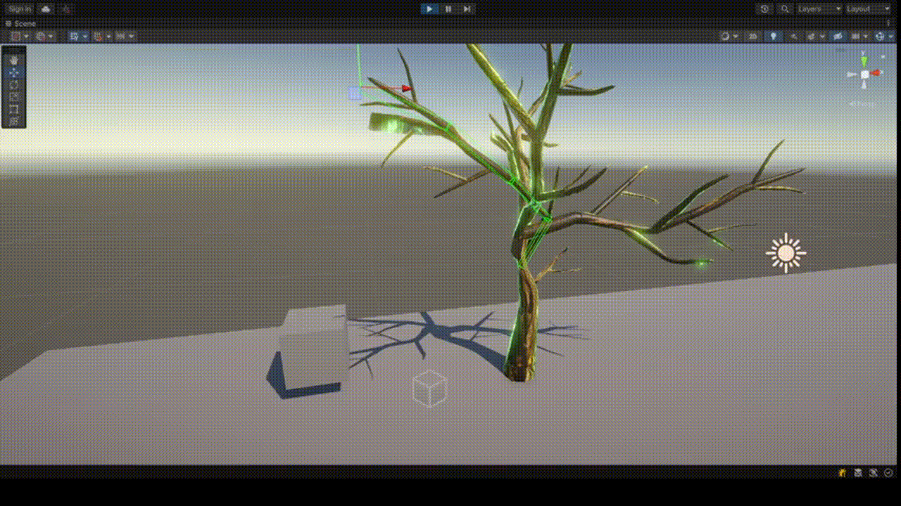
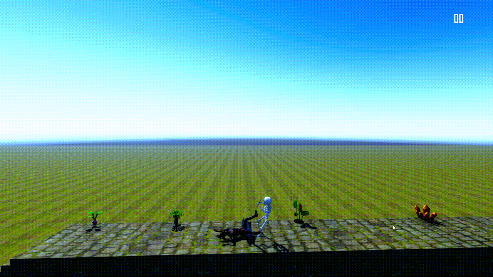

# Astral Adventure

## Overview

Astral Adventure is an action-adventure game with environmental puzzle mechanics in a 3D fantasy setting. Players control a wizard character who possesses the unique ability to transform into a spirit. The game emphasizes exploration, tactical combat with fire and ice spells, and environmental manipulation to progress through levels.

The core gameplay loop centers around the **Spirit Transformation** mechanic, where the player can leave their physical body to navigate the environment or trigger specific mechanisms. Players must solve puzzles using levers and buttons, defeat skeletal minions, and ultimately face powerful bosses like the Tree Monster.

### Architectural Design Patterns
1. **Decoupled Component-Based Architecture**: Utilizing Unity's composition over inheritance, logic is partitioned into focused MonoBehaviours. This ensures high maintainability and allows for rapid iteration of entity capabilities (e.g., `PlayerMovement` is independent of `SpellIncantaton`).
2. **State Pattern (Finite State Machines)**: 
   - **Enemy AI**: Implements a robust FSM for transition logic between Patrol, Pursuit, and Attack states based on proximity and line-of-sight triggers.
   - **Player States**: Manages the binary state between Physical and Spirit forms, handling the synchronization of input sets, physics layers, and visual filters.
3. **Observer Pattern (Event-Driven Systems)**: Uses C# `Actions` and `Events` to facilitate communication between decoupled systems. For instance, `LeverTrigger` broadcasts activation events that environmental listeners (doors, platforms) subscribe to, eliminating hard-coded dependencies.
4. **Kinematic Movement Strategy**: Implementation of a non-physics-based movement system via `CharacterController`. This provides frame-perfect precision for platforming and avoids the non-deterministic behavior associated with Rigidbody physics in complex environmental interactions.
5. **Manager/Singleton Pattern**: Centralized controllers like `GameManager` and `PlayerManager` maintain global game state and lifecycle management, providing a single source of truth for time-sensitive mechanics like the Spirit Timer.
6. **Data-Driven Constants**: Centralization of global identifiers (Tags, Animation Parameters, Shader Properties) in the `staticString` class to prevent "Magic Strings" and reduce runtime errors during string-based lookups.
7. **Math Utility Extensions**: Implementation of advanced interpolation algorithms (Linear, Bicubic) to ensure smooth procedural animations and responsive UI feedback, demonstrating a deep understanding of game-feel and juice.
8. **Custom FABRIK IK Solver**: Implementation of a **Forward And Backward Reaching Inverse Kinematics (FABRIK)** algorithm for dynamic limb positioning.
   - **Iterative Joint Resolution**: Features a configurable solver that balances performance and precision (default 10 iterations) to minimize positional delta.
   - **Pole Constraints**: Utilizes secondary targets (Poles) to control joint bending direction (e.g., elbow or knee orientation), ensuring bio-mechanical realism in procedural animations.
   - **Root-Space Stability**: Calculations are performed in local root space to prevent jitter and floating-point errors during high-speed character movement.
   - **Snap-Back Logic**: Integrated pose recovery strength to maintain character silhouette even when IK targets are out of reach.


### Assembly Structure

The project is organized into the following assemblies:

- **Project**: The main assembly containing core game logic and global managers.
- **PlayerAssembly**: Manages player-specific systems: movement, animation, input handling, and spell casting.
- **NPCProject**: Handles AI behavior for enemies (minions).
- **Boss.Assembly**: Dedicated to complex boss encounter logic, specifically the Tree Monster AI.
- **Environment**: Manages environmental triggers, puzzles, traps, and level-specific logic.
- **ManagerDef**: Handles level management, scene transitions, and death/respawn systems.


## Core Mechanics

### Spirit Transformation
A defining feature where the wizard can transform into a spirit form (`Q` key). 
- **Time Limit**: The transformation lasts for 10 seconds.
- **Mechanics**: The spirit form can interact with specific triggers and navigate areas differently. While in spirit form, the physical body remains vulnerable.
- **Visuals**: Uses custom shaders for grayscale and alpha clipping effects to distinguish between the physical and spiritual realms.

### Spell Casting & Combat
The wizard uses magical incantations for combat and interaction:
- **Fire & Ice Spells**: `SpellIncantaton` manages the casting of area-of-effect fire and ice circles at the target location.
- **Targeting**: Uses raycasting to precisely place spells on the ground based on player aim.
- **Combat Flow**: Spells deal damage through the `Damage` system, triggering enemy death sequences and animations.

### Environmental Puzzles
- **Moving Platforms**: Managed by the `PuzzleEngine`, which uses `CharacterController` logic to ensure players stay on platforms while they move.
- **Interactions**: Players use the `Y` key to interact with `LeverTrigger` and `ButtonTrigger` objects.
- **Trigger Chains**: Puzzles often involve activating multiple triggers to unlock doors or reveal new paths.

## Feature Overview

| Feature | System | Key Components |
|---------|--------|-----------------|
| Character Movement | Player System | `PlayerMovement`, `PlayerAnimation`, `PlayerManager` |
| Spirit Form | Transformation | `PlayerManager`, `Spirit` tag, Dissolve Shaders |
| Magic & Combat | Spell System | `SpellIncantaton`, `Attack`, `FlyableObject` |
| Enemy AI | NPC System | `Enemy`, `EnemyMovement` (Patrol/Chase), `EnemyAnimation` |
| Boss Battles | Boss System | `treeMonster` (Oscillator-based branch attacks) |
| Puzzles | Mechanics | `PuzzleEngine`, `LeverTrigger`, `ButtonTrigger` |
| Level Management | Progression | `NextLevel`, `LevelCompleteTrigger`, `DeathMenu` |
| UI & Menus | Interface | `PauseMenu`, `ApplicationQuit`, `Canvas` systems |

---

## Controls

| Action | Key |
|--------|-----|
| Movement | WASD / Arrows |
| Jump | Space |
| Spirit Transformation | Q |
| Interact (Levers/Buttons) | Y |
| Cast Spell | Left Mouse Click |

---


## Technical Implementation Details

### Player Systems
- **`PlayerMovement`**: Implements kinematic movement using Unity's `CharacterController`, handling gravity and slope interactions.
- **`PlayerManager`**: The central hub for player state, managing health, life status, and the spirit transformation timer.
- **`WizardInputHandler`**: Routes inputs from the Unity Input System to gameplay actions.

### Environment & Puzzles
- **`PuzzleEngine`**: Smoothly moves objects between two transforms. It includes specialized `OnTriggerStay` logic to move the player's `CharacterController` in sync with the platform.
- **`LeverTrigger`**: A toggleable mechanism that invokes `triggerActivate` and `triggerNotActivate` events, allowing for complex multi-object puzzle sequences.

---

## Visual Demonstrations

- **Gameplay Overview**:  
   
- **IK & Interactions**:  
  
- **Death Screen**:  
  

---

## Project Structure

```
Assets/
├── Main/
│   ├── Script/
│   │   ├── Player/                 # Movement, Spirit Form, Attack systems
│   │   ├── NPC/                    # Minion AI and Boss logic (Tree Monster)
│   │   ├── Environments/           # Puzzles, Levers, Platforms, Triggers
│   │   ├── Level Manager/          # Scene transitions and Death UI
│   │   ├── Game UI/                # Pause and Menu logic
│   │   ├── Audio/                  # Sound management
│   │   ├── Static Resource/        # Global tags and string constants
│   │   └── ProceduralObject/       # Voxel utilities
│   │
│   ├── Level Design/               # Unity Scenes (.unity)
│   ├── User Interface/             # UI Prefabs and Canvas layouts
│   └── Assets/                     # 3D Models, Materials, and Textures
```

---

## Development Notes

### Key Classes & Responsibilities
- **`PlayerManager`**: Handles the 10s spirit timer and body/spirit switching.
- **`SpellIncantaton`**: (Note: Filename contains a typo in code) Manages fire/ice spell instantiation.
- **`PuzzleEngine`**: The core of all moving environmental elements.
- **`Enemy`**: A base class that delegates behavior to `EnemyMovement`, `EnemyAnimation` & `EnemyCombat`.
